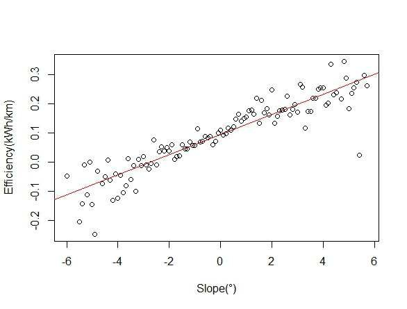
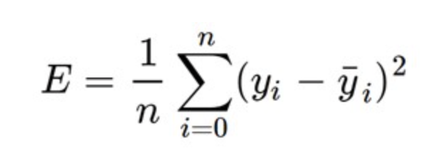
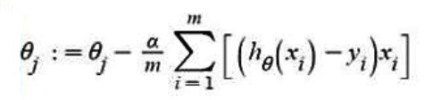

# Linear regression for real estate data

## What's linear regression?
Linear regression (LR) is a supervised machine learning algorithm that tries to fit the data you give it into a linear model. Before trying to use linear regression you should look for a linear relationship between the variables. If there's no linear relationship between them, this algorithm won't work. [1]

### Linear model
To find a linear relationship in your data you first need to know what that looks like. Luckily, it is simple, you just need to plot the data and if it looks something like a straight line, then there's a linear relationship between some or all the variables in your data. [1]

Example:



Figure 1: Example of a linear relationship [2]

A linear model equation has the form y = mx + b. However, this doesn't mean you can only use it with one variable. More complex linear equations have the form y = m1x1 + m2x2 + ... + mnxn + b.

In both cases, b is the bias. The bias is easily understood as the point where the line crosses the y axis (this happens when all x values are 0).

On the other hand, m is the slope. You get the slope of a linear function using the following: m = (y1-y0)/(x1-x0). In simpler terms, the slope is calculated by doing rise over run.

## Gradient Descent
In this project I use gradient descent to optimize the model which ends up being the same as minimizing the mean squared error (cost function). We achieve this by updating the parameters until we reach a certain number of rounds (epochs), we get an acceptable error or until the parameters are no longer being updated because they are as accurate as they can be.

### Mean squared error
The mean squared error is calculated by getting the average of the difference between the real 'y' values of the data and the 'y' values obtained by using the proposed model. Each difference is squared before being averaged so that the signs don't mess with the result. This is why it is called mean squared error.

This sums up to the following equation:


Figure 2: Mean squared error equation [3]

### Updating parameters
The parameters are updated one by one, but we don't rewrite the previous value of each parameter until we're done calculating the update for all of them. The update for each parameter is calculated as follows:



Figure 3: Parameter update equation [4]

In this function theta represents the jth parameter (you have to apply the formula for each of them). Alpha is the learning rate or size of the step. m is the number of instances in your data. h(xi) is the hypothesis for the ith instance. yi is the y value for the ith instance. Finally, xi is the value of the jth column for the ith instance of your data.

## Data set
The data set I used for this project can be found in Kaggle. The name of the data set is "Real estate price prediction" and was submitted by a guy named Bruce (I couldn't find his last name). [5] This data was collected from Sindian Dist., New Taipei City, Taiwan.

The parameters I used are the following:
- Transaction date (for example, 2013.250=2013 March, 2013.500=2013 June, etc.) 
- House age (unit: year) 
- Distance to the nearest MRT (mass rapid transit) station (unit: meter) 
- Number of convenience stores in the living circle on foot (integer) 
- Geographic coordinate, latitude. (unit: degree) 
- Geographic coordinate, longitude. (unit: degree)

(I added an additional attribute to be able to update de b parameter of the model, I filled this column with 1)

The value we wish to predict (our y) is:
- House price of unit area (10000 New Taiwan Dollar/Ping, where Ping is a local unit, 1 Ping = 3.3 meter squared) 
[7]

## How to run the project
Run the .py file: ``` python3 linear_regression.py```

The model's info will be displayed.

To make a prediction enter the requested info.

After entering this info, the program will show you the prediction. It will then ask you if you want to make another prediction (enter Y to make another prediction and N to stop the execution of the program).

## References
[1] Yale. (n.d.). Linear Regression. [Online] Available: [http://www.stat.yale.edu/Courses/1997-98/101/linreg.htm]

[2] Blythe, P. (2012). Fitting a linear model example. ResearchGate. [Online] Available: [https://www.researchgate.net/figure/Fitting-a-Linear-model-example_fig3_261385683]

[3] Menon, A. (2018). Linear Regression using gradiant descent. Towards data science. [Online] Available: [https://towardsdatascience.com/linear-regression-using-gradient-descent-97a6c8700931]

[4] GeeksforGeeks. (2020). Gradient descent in linear regression. [Online] Available: [https://www.geeksforgeeks.org/gradient-descent-in-linear-regression/]

[5] Bruce. (2019). Real estate price prediction. Kaggle. [Online] Available: [https://www.kaggle.com/quantbruce/real-estate-price-prediction]

[6] Yeh, I. C., & Hsu, T. K. (2018). Building real estate valuation models with comparative approach through case-based reasoning. Applied Soft Computing, 65, 260-271.

[7] UCI. (2018). Real estate valuation data set. [Online] Available: [https://archive.ics.uci.edu/ml/datasets/Real+estate+valuation+data+set#]